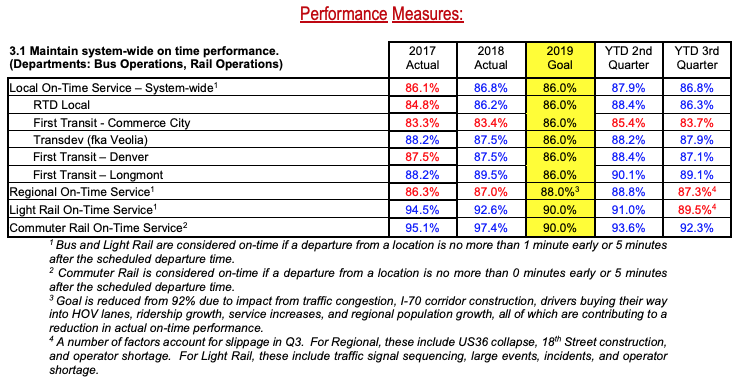

# RTD On Time Departure

## Background
---
The mission of Denver's Regional Transportation District (RTD) is to **provide convenient bus and rail service to the Denver Metro Area**. RTD operates more than 170 bus routes, 12 rail lines, and specialty services like Park-N-Ride for commuters, Access-A-Ride for disabled rides, and the free 16th Street Mall Ride. According to the 2019 Board of Directors Report, RTD's [2019Q3 KPI for local on-time performance was 86%](https://www.rtd-denver.com/sites/default/files/files/2020-01/Q3-2019-KPIs.pdf)



I would like to investigate whether or not they are still meeting this goal and what lines/routes have a higher or lower on-time performance than the entire system as whole. My hypotheses will be:

* $\large H_0 \large$: RTD's Local On-Time Service >= 86%
* $\large H_A \large$: RTD's Local On-TIme Service < 86%

## Dataset
---
My dataset is pulled from [RTD's Public GTFS-RT (General Transit Feed Specification - Realtime Transit) Feeds](https://www.rtd-denver.com/business-center/open-spacial-data/gtfs-rt). There are 3 feeds in RTD's GTFS-RT data:
1. **Alerts**: This feed includes alerts about unforseen events like route disruptions and stop closures.
2. **Trips**: This feed includes trip progress and arrival/departure predictions including delays, cancellations, or changed routes.
3. **Vehicle Position**: This feed includes vehicle locations, upcoming stop, and can include optional data like congestion level of the vehicle.

GTFS-RT is documented on [Google's devlopers page](https://developers.google.com/transit/gtfs-realtime/) and outlines the data format and structure as well as how they use GTFS realtime in Google Maps.

When you make a call to a GTFS-RT feed, you will get two main packets of information: the header and entity. The header includes data about the feed (gtfs_realtime_version, incrementality, and timestamp) and the entity will include data specific to the feed (alerts, trips, or vehicle positions). I decided to use the Vehicle Positions feed since it would give me the most accurate data for where a vehicle is currently located and when they have arrived/departed from a stop. The data I pulled from the Vehicle Positions feed include:

| Variable name         | Data type | Description                                                                                                                                   |
|-----------------------|-----------|-----------------------------------------------------------------------------------------------------------------------------------------------|
| entity_id             | String    | Unique identifier for the row, consists of vehicle_label and timestamp.                                                                       |
| trip_id               | Integer   | Unique indentifier for a vehicle and route.                                                                                                   | 
| schedule_relationship | Integer   | The relationship between the trip and the static schedule. Can be one of: SCHEDULED=0, ADDED=1, CANCELED=2 in integer form.                   | 
| route_id              | String    | The unique identifier for a route usually displayed on the vehicle for identification. Examples include 15, 15L, FF1, 104L, Anschutz Shuttle. | 
| direction_id          | Integer   | Either a 1 or 0. Indicates the direction of travel for the route. (Southbound, Westbound, Northbound, etc.)                                   | 
| vehicle_lat           | Float     | The vehicle's current Degrees North in the WGS-84 coordinate system.                                                                          | 
| vehicle_lng           | Float     | The vehicle's current Degrees East in the WGS-84 coordinate system.                                                                           | 
| bearing               | Integer   | Bearing, in degrees, clockwise from True North, i.e., 0 is North and 90 is East.                                                              | 
| current_status        | Integer   | Either a 0,1, or 2 indicating the vehicle's current status in relation to the upcoming stop. INCOMING_AT=0, STOPPED_AT=1, IN_TRANSIT_TO=2     | 
| timestamp             | DateTime  | The date time at which the vehicle's real-time progress was measured.                                                                         | 
| stop_id               | Integer   | Unique identifier of the stop according to the route_id and trip_id.                                                                          | 
| vehicle_id            | String    | Unique identifier of the vehicle in string form. Either a 4 digit string or a 32 character string.                                            | 
| vehicle_label         | Integer   | Unique identifier of the vehicle in integer form.                                                                                             | 

In order to make sure I was capturing enough data to see if a vehicle had made it to it's stop on time without overtaxing RTD's system, I polled the Vehicle Position feed every minute from February 16th, 2020 to February 22nd, 2020. Since I only wanted vehicles that were on a trip (and not vehicles that were out of service or on their way back to RTD facilities) I limited my pull to only entities that where on a trip using `entity.vehicle.HasField('trip')`. I stored the results into a CSV file for later data analysis.

### GTFS Data

In addition to realtime data feeds, RTD also has GTFS files that include additional static data to complement the realtime feeds. The GTFS data I included are:

1. **Trips**: Includes additional information about a specific trip, stored in a text file with comma delimeters for the following columns:

| Variable name | Data type | Description                                                                                                                                                          |
|---------------|-----------|----------------------------------------------------------------------------------------------------------------------------------------------------------------------|
| block_id      | String    |                                                                                                                                                                      |
| route_id      | String    | Corresponds to the Route ID in the main dataset                                                                                                                      |
| direction_id  | Integer   | Corresponds to the Direction ID in the main dataset                                                                                                                  |
| trip_headsign | String    | User friendly indicator of which direction the vehicle is travelling, usually displayed at the front of the vehicle. Either the start point or end point of a route. |
| shape_id      | Integer   |                                                                                                                                                                      |
| service_id    | String    |                                                                                                                                                                      |
| trip_id       | Integer   | **Primary key to join to the main dataset**                                                                                                                          |

2. **Routes**: Includes additional information about a specific route, stored in a text file with comma delimeters for the following columns:

| Variable name    | Data type | Description                                                                            |
|------------------|-----------|----------------------------------------------------------------------------------------|
| route_long_name  | String    | The starting stops and ending stops of the route.                                      |
| route_short_name | String    | Same as route_id.                                                                      |
| route_type       | Integer   | The vehicle mode, LIGHT_RAIL=0, COMMUTER_RAIL=2, BUS=3.                                |
| route_text_color | String    | Hexadecimal color code of the route name and text.                                     |
| route_color      | String    | Hexadecimal color code of the route line.                                              |
| agency_id        | String    | What agency the route belongs to, in my case this will be RTD.                         |
| route_id         | String    | **Primary key to join to the main dataset**                                            |
| route_url        | String    | URL to lookup the route on RTD's website.                                              |
| route_desc       | String    | Which directions the route travels. (Eastbound & Westbount or Northbound & Southbound) |

3. **Stops**: Includes additional information about a specific stop, stored in a text file with comma delimeters for the following columns:

| Variable name        | Data type | Description                                                                                                                                              |
|----------------------|-----------|----------------------------------------------------------------------------------------------------------------------------------------------------------|
| stop_id              | Integer   | **Primary key to join to the main dataset**                                                                                                              |
| stop_name            | String    | User friendly name for the stop, usually consisting of cross-streets adjacent to that stop.                                                              |
| stop_desc            | String    | Indicates which direction vehicles are travelling when approaching the stop.                                                                             |
| stop_code            | Integer   |                                                                                                                                                          |
| zone_id              | Integer   |                                                                                                                                                          |
| location_type        | Integer   | Either a 0 or 1. 0=Stop or Platform where passengers board or disembark from a transit vehicle. 1=Station which can contain one or more stops/platforms. |
| stop_lat             | Float     | The stop's Degrees North in the WGS-84 coordinate.                                                                                                       |
| stop_lon             | Float     | The stop's Degrees East in the WGS-84 coordinate.                                                                                                        |
| stop_timezone        | String    |                                                                                                                                                          |
| stop_url             | String    | URL to lookup the route on RTD's website.                                                                                                                |
| parent_station       | Integer   | stop_id of the parent location if location_type = 0 and a parent station exists.                                                                         |
| wheelchair_boarding  | Integer   | Either a 0 or 1. 0=No accessibility information for the stop. 1=Some vehicles at this stop can be boarded by a rider in a wheelchair.                    |

4. **Stop Times**: Includes additional information about a specific stop for a specific trip, stored in a text file with comma delimeters for the following columns:

| Variable name       | Data type | Description                                                                                                                                                                                                  |
|---------------------|-----------|--------------------------------------------------------------------------------------------------------------------------------------------------------------------------------------------------------------|
| trip_id             | Integer   | **Primary key combined with stop_id to join to the main dataset**                                                                                                                                            |
| arrival_time        | String    | Time in format %h:%m:%s of the scheduled arrival for that stop and trip.                                                                                                                                     |
| departure_time      | String    | Time in format %h:%m:%s of the scheduled departure for that stop and trip.                                                                                                                                   |
| stop_id             | Integer   | **Primary key combined with trip_id to join to the main dataset**                                                                                                                                            |
| stop_sequence       | Integer   | What number the stop is of all the trip's stops.                                                                                                                                                             |
| stop_headsign       | String    | Corresponds to the trip headsign or end stop of the trip.                                                                                                                                                    |
| pickup_type         | Integer   | Indicates the pickup method. In my case all trips will be 0 or empty indicating a regularly scheduled pickup.                                                                                                |
| drop_off_type       | Integer   | Indicates the drop_off method. In my case all trips will be 0 or empty indicating a regularly scheduled dropoff.                                                                                             |
| shape_dist_traveled | String    | Actual distrance traveled along the associated shape. This can be used by apps to show how far a vehicle has traveled along their route.                                                                     |
| timepoint           | String    | Either a 0 or 1. Indicates if arrival and departure times for a stop are strickly adhered to by the vehicle or if they are approximations. In my case, all trips will be 0=Times are considered approximate. |

### Data Cleaning

In order to get the data ready for analysis, I needed to clean up any missing/illogical values and arrange the data points so that I could determine whether or not a vehicle was at a stop. 

My first step in cleaning the data was to make sure none of my timestamp values were `NULL`. By looking at the shape values before and after, I can see that the only null value was when I initialized the CSV with the column headers and a null value for each column. 

Next, I needed to convert the timestamp field into a Pandas datatime with the local timezone `('US/Mountain')`. Since the timestamp values were currently integers representing Unix timestamps, this was a fairly easy process by using: 
```python
pd.to_datetime(timestamp, unit='s').dt.tz_localize('UTC').dt.tz_convert('US/Mountain')
``` 

Since I polled the Vehicle Position feed every minute, there will often be rows that include a vehicle in transit to a stop. I decided to solve for this issue first by sorting the data by vehicle, then timestamp which will give me ordinal data as the vehicle moves along their trip. Once I had that, I needed to see if the current row was a vehicle arriving at a station. In order to determine this, I needed to see if the next row after had a different stop_id (indicating that the vehicle was either at or very soon arriving at a stop). I grouped my Pandas DataFrame by `trip_id` and `vehicle_label` and shifted `stop_id` by -1 to see if the next row had a different stop_id from the current_row. Finally I removed any rows where the `current_stop_id` == `next_stop_id` since those meant that the vehicle was in transit to the next stop and not currently there.

Once I had my data down to just rows where a vehicle was at or immediately arriving at a stop, I performed the more computationally intensive operations like: 
* joining the .txt files from the GTFS data by their primary keys in the main data set 
* selecting just the columns I wanted to use going forward
* Replacing the integer codes in current_status and route_type with their real-world values:

    ```python
    status_dict = {0: 'incoming_at'
                  ,1: 'stopped_at'
                  ,2: 'in_transit_to'}

    route_dict = {0: 'light_rail'
                 ,2: 'commuter_rail'
                 ,3: 'bus'}
    ```
* Renaming columns so that I don't get confused with arriving or departing data (departing data is the data shifted by -1)
* Calculating the time in minutes between the arrival/departure timestamp and the scheduled arrival/departure times
* Calculating the distance in meters between the arrival/departure lat/lng and the next stop's lat/lng

During the process of cleaning the data, I noticed that several days were missing entirely (from 2021-02-19 19:45 to 2021-02-22 07:55). This appears to have been caused by renaming my repository from **Capstone_1** to **rtd_on_time_departure**. The name change had several downstream impacts, most significantly on the crontab job I had running where the directory name was no long found. While this is unfortunate, it will not severly impact my overall analysis.

## EDA

## Conclusions

## Future Work