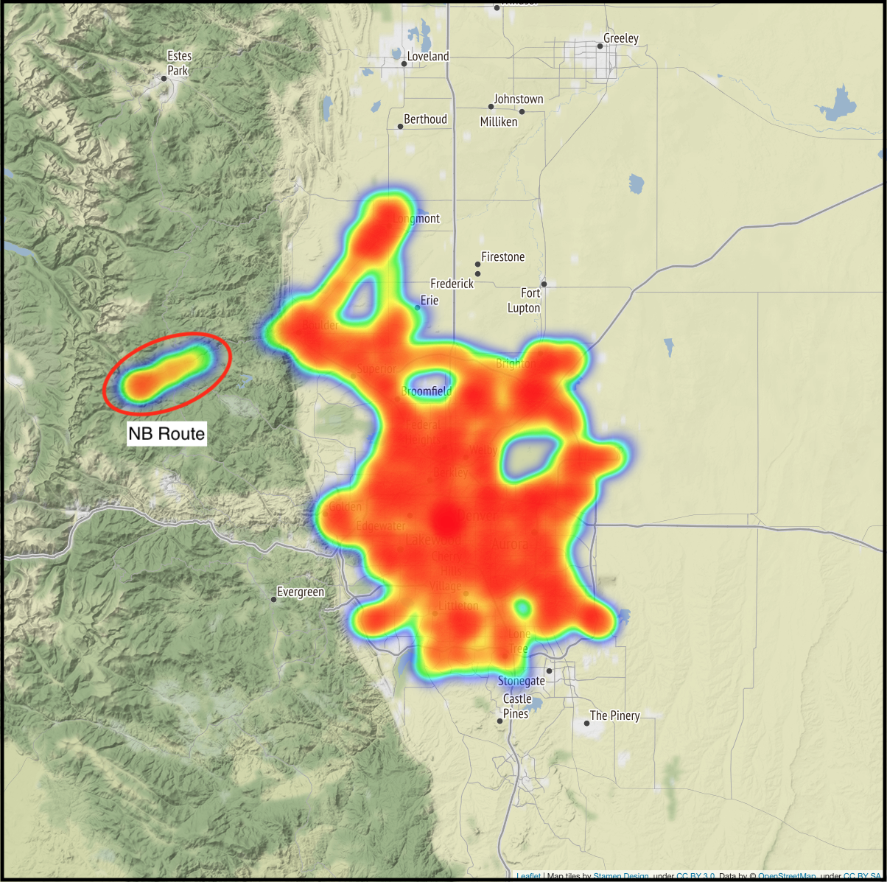
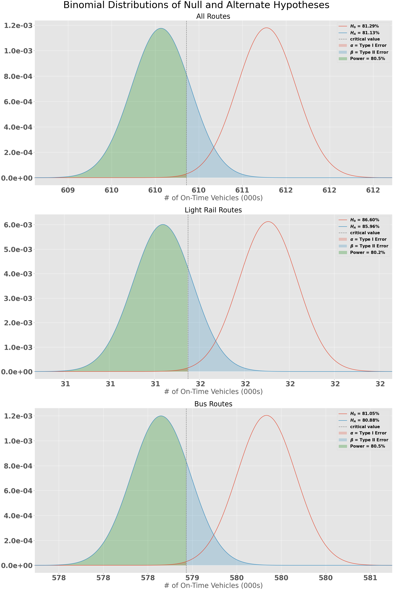
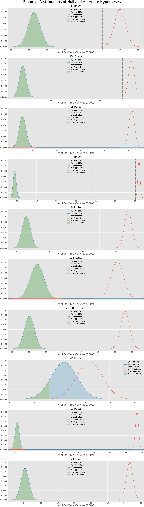

# RTD On-Time Departure

## Dataset

### GTFS-RT
My dataset is pulled from [RTD's Public GTFS-RT (General Transit Feed Specification - Realtime Transit) feeds](https://www.rtd-denver.com/business-center/open-spacial-data/gtfs-rt). There are 3 feeds in RTD's GTFS-RT data:
1. **Alerts**: This feed includes alerts about unforeseen events like route disruptions and stop closures.
2. **Trips**: This feed includes trip progress and arrival/departure predictions including delays, cancellations, or changed routes.
3. **Vehicle Position**: This feed includes vehicle locations, the upcoming stop, and can include optional data like congestion level (occupancy) of the vehicle.

GTFS-RT is documented on [Google's developers page](https://developers.google.com/transit/gtfs-realtime/) and outlines the data format and structure as well as how they use GTFS realtime in Google Maps.

When you make a call to a GTFS-RT feed, you will get two main packets of information: the header and entity. The header includes data about the feed (gtfs_realtime_version, incrementality, and timestamp) and the entity will include data specific to the feed (alerts, trips, or vehicle positions). I decided to use the Vehicle Positions feed since it would give me the most accurate data for where a vehicle is currently located and when they have arrived/departed from a stop. The data I pulled from the Vehicle Positions feed include:

| Variable name         | Data type     | Description                                                                                                                                   |
|-----------------------|---------------|-----------------------------------------------------------------------------------------------------------------------------------------------|
| entity_id             | String        | Unique identifier for the row, consists of vehicle_label and timestamp.                                                                       |
| trip_id               | Integer       | Unique identifier for a vehicle and route.                                                                                                    | 
| schedule_relationship | Integer       | The relationship between the trip and the static schedule. Can be one of: SCHEDULED=0, ADDED=1, CANCELED=2 in integer form.                   | 
| route_id              | String        | The unique identifier for a route usually displayed on the vehicle for identification. Examples include 15, 15L, FF1, 104L, Anschutz Shuttle. | 
| direction_id          | Integer       | Either a 1 or 0. Indicates the direction of travel for the route. (Southbound, Westbound, Northbound, etc.)                                   | 
| vehicle_lat           | Float         | The vehicle's current Degrees North in the WGS-84 coordinate system.                                                                          | 
| vehicle_lng           | Float         | The vehicle's current Degrees East in the WGS-84 coordinate system.                                                                           | 
| bearing               | Integer       | Bearing, in degrees, clockwise from True North, i.e., 0 is North and 90 is East.                                                              | 
| current_status        | Integer       | Either a 0,1, or 2 indicating the vehicle's current status in relation to the upcoming stop. INCOMING_AT=0, STOPPED_AT=1, IN_TRANSIT_TO=2     | 
| timestamp             | DateTime      | The date time at which the vehicle's real-time progress was measured.                                                                         | 
| stop_id               | Integer       | Unique identifier of the stop according to the route_id and trip_id.                                                                          | 
| vehicle_id            | String        | Unique identifier of the vehicle in string form. Either a 4 digit string or a 32 character string.                                            | 
| vehicle_label         | Integer       | Unique identifier of the vehicle in integer form.                                                                                             | 

In order to make sure I was capturing enough data to see if a vehicle had made it to a stop on time without overtaxing RTD's system, I polled the Vehicle Position feed every minute from February 16th, 2020 to February 22nd, 2020. Since I only wanted vehicles that were on a trip (and not vehicles that were out of service or on their way back to RTD facilities) I limited my pull to only entities that were on a trip using `entity.vehicle.HasField('trip')`. I stored the results into a CSV file for later data analysis.

### GTFS Data

In addition to realtime data feeds, RTD also has GTFS files that include additional static data to complement the realtime feeds. The GTFS data I included are:

1. **Trips**: Includes additional information about a specific trip, stored in a text file with comma delimiters for the following columns:

| Variable name     | Data type     | Description                                                                                                                                                          |
|-------------------|---------------|----------------------------------------------------------------------------------------------------------------------------------------------------------------------|
| block_id          | String        |                                                                                                                                                                      |
| route_id          | String        | Corresponds to the Route ID in the main dataset                                                                                                                      |
| direction_id      | Integer       | Corresponds to the Direction ID in the main dataset                                                                                                                  |
| trip_headsign     | String        | User friendly indicator of which direction the vehicle is travelling, usually displayed at the front of the vehicle. Either the start point or end point of a route. |
| shape_id          | Integer       |                                                                                                                                                                      |
| service_id        | String        |                                                                                                                                                                      |
| trip_id           | Integer       | **Primary key to join to the main dataset**                                                                                                                          |

2. **Routes**: Includes additional information about a specific route, stored in a text file with comma delimiters for the following columns:

| Variable name    | Data type      | Description                                                                            |
|------------------|----------------|----------------------------------------------------------------------------------------|
| route_long_name  | String         | The starting stops and ending stops of the route.                                      |
| route_short_name | String         | Same as route_id.                                                                      |
| route_type       | Integer        | The vehicle mode, LIGHT_RAIL=0, COMMUTER_RAIL=2, BUS=3.                                |
| route_text_color | String         | Hexadecimal color code of the route name and text.                                     |
| route_color      | String         | Hexadecimal color code of the route line.                                              |
| agency_id        | String         | What agency the route belongs to, in my case this will be RTD.                         |
| route_id         | String         | **Primary key to join to the main dataset**                                            |
| route_url        | String         | URL to lookup the route on RTD's website.                                              |
| route_desc       | String         | Which directions the route travels. (Eastbound & Westbound or Northbound & Southbound) |

3. **Stops**: Includes additional information about a specific stop, stored in a text file with comma delimiters for the following columns:

| Variable name        | Data type  | Description                                                                                                                                              |
|----------------------|------------|----------------------------------------------------------------------------------------------------------------------------------------------------------|
| stop_id              | Integer    | **Primary key to join to the main dataset**                                                                                                              |
| stop_name            | String     | User friendly name for the stop, usually consisting of cross-streets adjacent to that stop.                                                              |
| stop_desc            | String     | Indicates which direction vehicles are travelling when approaching the stop.                                                                             |
| stop_code            | Integer    |                                                                                                                                                          |
| zone_id              | Integer    |                                                                                                                                                          |
| location_type        | Integer    | Either a 0 or 1. 0=Stop or Platform where passengers board or disembark from a transit vehicle. 1=Station which can contain one or more stops/platforms. |
| stop_lat             | Float      | The stop's Degrees North in the WGS-84 coordinate.                                                                                                       |
| stop_lon             | Float      | The stop's Degrees East in the WGS-84 coordinate.                                                                                                        |
| stop_timezone        | String     |                                                                                                                                                          |
| stop_url             | String     | URL to lookup the route on RTD's website.                                                                                                                |
| parent_station       | Integer    | stop_id of the parent location if location_type = 0 and a parent station exists.                                                                         |
| wheelchair_boarding  | Integer    | Either a 0 or 1. 0=No accessibility information for the stop. 1=Some vehicles at this stop can be boarded by a rider in a wheelchair.                    |

4. **Stop Times**: Includes additional information about a specific stop for a specific trip, stored in a text file with comma delimiters for the following columns:

| Variable name       | Data type   | Description                                                                                                                                                                                                  |
|---------------------|-------------|--------------------------------------------------------------------------------------------------------------------------------------------------------------------------------------------------------------|
| trip_id             | Integer     | **Primary key combined with stop_id to join to the main dataset**                                                                                                                                            |
| arrival_time        | String      | Time in format %h:%m:%s of the scheduled arrival for that stop and trip.                                                                                                                                     |
| departure_time      | String      | Time in format %h:%m:%s of the scheduled departure for that stop and trip.                                                                                                                                   |
| stop_id             | Integer     | **Primary key combined with trip_id to join to the main dataset**                                                                                                                                            |
| stop_sequence       | Integer     | What number the stop is of all the trip's stops.                                                                                                                                                             |
| stop_headsign       | String      | Corresponds to the trip headsign or end stop of the trip.                                                                                                                                                    |
| pickup_type         | Integer     | Indicates the pickup method. In my case all trips will be 0 or empty indicating a regularly scheduled pickup.                                                                                                |
| drop_off_type       | Integer     | Indicates the drop_off method. In my case all trips will be 0 or empty indicating a regularly scheduled dropoff.                                                                                             |
| shape_dist_traveled | String      | Actual distance traveled along the associated shape. This can be used by apps to show how far a vehicle has traveled along their route.                                                                     |
| timepoint           | String      | Either a 0 or 1. Indicates if arrival and departure times for a stop are strictly adhered to by the vehicle or if they are approximations. In my case, all trips will be 0=Times are considered approximate. |

### Data Cleaning

In order to get the data ready for analysis, I needed to clean up any missing/illogical values and arrange the data points so that I could determine whether or not a vehicle was at a stop. 

My first step in cleaning the data was to make sure none of my timestamp values were `NULL`. By looking at the shape values before and after, I can see that the only null value was when I initialized the CSV with the column headers and a null value for each column. 

Next, I needed to convert the timestamp field into a Pandas datatime with the local timezone `('US/Mountain')`. Since the timestamp values were currently integers representing Unix timestamps, this was a fairly easy process by using: 
```python
pd.to_datetime(timestamp, unit='s').dt.tz_localize('UTC').dt.tz_convert('US/Mountain')
``` 

Since I polled the Vehicle Position feed every minute, there will often be rows that include a vehicle in transit to a stop. I decided to solve for this issue first by sorting the data by vehicle, then timestamp which will give me ordinal data as the vehicle moves along their trip. Once I had that, I needed to see if the current row was a vehicle arriving at a station. In order to determine this, I needed to see if the next row after had a different stop_id (indicating that the vehicle was either at or very soon arriving at a stop). I grouped my Pandas DataFrame by `trip_id` and `vehicle_label` and shifted `stop_id` by -1 to see if the next row had a different stop_id from the current_row. Finally I removed any rows where the `current_stop_id` == `next_stop_id` since those meant that the vehicle was in transit to the next stop and not currently there.

Once I had my data down to just rows where a vehicle was at or immediately arriving at a stop, I performed the more computationally intensive operations like: 
* joining the .txt files from the GTFS data by their primary keys in the main data set 
* selecting just the columns I wanted to use going forward
* Replacing the integer codes in current_status and route_type with their real-world values:

    ```python
    status_dict = {0: 'incoming_at'
                  ,1: 'stopped_at'
                  ,2: 'in_transit_to'}

    route_dict = {0: 'light_rail'
                 ,2: 'commuter_rail'
                 ,3: 'bus'}
    ```
* Renaming columns so that I don't get confused with arriving or departing data (departing data is the data shifted by -1)
* Calculating the time in minutes between the arrival/departure timestamp and the scheduled arrival/departure times
* Calculating the distance in meters between the arrival/departure lat/lng and the next stop's lat/lng

During the process of cleaning the data, I noticed that several days were missing entirely (from 2021-02-19 19:45 to 2021-02-22 07:55). This appears to have been caused by renaming my repository from **Capstone_1** to **rtd_on_time_departure**. The name change had several downstream impacts, most significantly on the crontab job I had running where the directory name was no longer found. While this is unfortunate, it will not severely impact my overall analysis.

## EDA
---
Now that I have my data in a workable state, I wanted to visualize the entire dataset to see the range of values I would be working with. 

### Vehicle Lat / Lngs
First, I started with all the vehicle lat/lng positions included in my cleaned dataset. If all the lat/lng positions are correct, they should fall well within the boundaries of [RTD's service area](https://gis-rtd-denver.opendata.arcgis.com/app/213a8d61194647ecb22bb5eb26accb8b). Using folium, I plotted the `vehicle_lat | vehicle_lng` points into a heatmap:

#### Vehicle Positions (World Zoom)

You can see from this image that there is a concentration of lat/lng points at (0,0) or [Null Island](https://en.wikipedia.org/wiki/Null_Island). GPS data is not perfect and oftentimes if there is an error logging at position it will report as (0,0). While the probability that RTD has a vehicle on Null Island is small, but never zero, I decided to remove these from my dataset.

#### Vehicle Positions (Colorado Zoom)

Next I zoomed in closer to the mass of points in Colorado and noticed that there is also a concentration of points to the southeast of Pueblo, close to La Junta, CO. These fall well outside of RTD's service area so I again decided to remove these by filtering out any points with a longitude >=  -104.8, well south of RTD's southern limit.

#### Vehicle Positions (Denver Zoom)

Lastly, I zoomed in on Denver to see if there were any other outliers that didn't fit within my dataset. There was a cluster of points that looked to be a vehicle traveling along Boulder Canyon Dr (Hwy 119) between Boulder and Nederland. I initially assumed this was a vehicle that got lost but forgot to turn off their GPS transponder. Upon further inspection though, this appears to be RTD's [NB route](https://www.rtd-denver.com/app/route/NB/schedule) which services Eldora Mountain Resort on Monday - Friday so there's no need to remove it from my dataset.

Next, I wanted to see what sort of range in departure_times I would be dealing with. In this case, a negative value means the vehicle left before the scheduled departure time and a positive value means it left after the scheduled departure time. I used a histogram to plot the distributions for all the stops:

### Distribution of Departure Times


It looks like 99.5% of my data falls within (-20, 20) minutes so I zoomed in there to get a better idea of the distribution. There is definitely a normal distribution here with a slight left skew as vehicles are more often slightly late than slightly early. Overall though, this gives me a good idea of where my departure times will fall for the dataset.

### Null Hypotheses
If we use the 2019Q3 goals (86% System, 90% Light Rail, 86% Bus) for our Null Hypothesis, we can see that COVID-19 and the RTD operator shortage of 2020 had significant impacts to the on-time departure rate. Since I am running 3 experiments:
$$\large H_{0_{system}}: \text{On Time Service >= 86\%}\ \| \ \large H_{A_{system}}: \text{On Time Service < 86\%}$$ 
$$\large H_{0_{\text{light rail}}}: \text{On Time Service >= 90\%}\ \| \ \large H_{A_{\text{light rail}}}: \text{On Time Service < 90\%}$$ 
$$\large H_{0_{\text{bus}}}: \text{On Time Service >= 86\%}\ \ \| \ \large H_{A_{\text{bus}}}: \text{On Time Service < 86\%}$$ 
I will need to correct for using my original stated $\large \alpha = 0.01$ by using the **Bonferroni correction**. I would instead use $\large \frac{0.01}{3}$ or $\large \alpha=0.003$. The p-value for each of our route types is below our $\large \alpha$, which means we can **reject the Null Hypothesis that RTD's on-time departure rate during the measured time period was 86% or greater**.


### Alternate Hypothesis
For each of our experiments, you can also see that the alternate hypothesis distribution is well below the critical value ($\large \alpha \large$=0.003) which results in a very little chance of Type I or Type II Errors. These graphs show us that there is indeed a difference between the stated on-time service goal of 86% (90% for Light Rail) and the observed on-time service from February 16th, 2020 - February 22nd, 2020. This of course makes sense because of what happened in 2020 with COVID-19 and the operator shortage.


### Modified Null Hypotheses
Since there is such a drastic difference between the 2019Q3 goal and current state, it might be better to estimate what would be a good goal for RTD to set for their routes? We can use the same statistical analysis to see what on-time service % would still be above the current state but within reach for significant improvement. For this experiment, I wanted to solve for a Null probability given my conditions:

$$\large n=\text{Observed number of stops}$$
$$\large \mu_A=\text{Observed on-time departure rate}$$
$$\large \alpha=0.003$$
$$\large \beta=0.20$$
$$\large Power=0.80$$

Given the above parameters I am able to solve for the difference between the observed on-time departure rate and the null hypothesis on-time departure rate. When I did this, I came up with the following 3 values for System wide, Light Rail, and Bus routes:

$$\large H_{0_{system}}: \text{On Time Service >= 81.29\%}$$ 
$$\large H_{0_{\text{light rail}}}: \text{On Time Service >= 86.60\%}$$ 
$$\large H_{0_{\text{bus}}}: \text{On Time Service >= 81.05\%}$$ 

These can be used by RTD to set attainable goals that will have a significant impact on the current state of on-time departures across the system. The difference between $H_0$ and $H_A$ is only a fraction of a percent in most cases, showing how small of a change you need for a significant difference when you have such a large number of observations.

&nbsp;

<!--  -->

<!-- ### Modified Alternate Hypotheses -->



### Top 10 Routes
I also wanted to dive one level deeper to see what the top 10 routes by # of stops collected look like compared to the goal of 86% on-time departure. The only route where we would fail to reject the Null Hypothesis is [Route 40](https://www.rtd-denver.com/app/nextride/route/40?direction=0) which travels North & South along Colorado Blvd. Our p-value of 0.024 is not < the alpha of $\frac{0.01}{10} = 0.001$ (correcting for multiple experiements using Bonferrroni again).

<!--  -->



### Map of Neighborhoods by On-Time Departure Percent
Finally, equity plays a large role in making sure that RTD is providing convenient and reliable service across the entire Metro Denver Area. So in order to determine this, I plotted the on-time departure rate across all Denver neighborhoods according to where the stop is located. You can dive into the map at [All Routes Neighborhood Map](html/All_neighborhood_map.html)


You can see that several neighborhoods have a lower on-time departure percentage than the system average, specifically:

| Neighborhood name | On-Time Departure % | 
|-------------------|---------------------|
| Globeville        | 59.0%               |
| City Park West    | 68.3%               |
| Five Points       | 72.0%               |
| East Colfax       | 72.7%               |
| Elyria Swansea    | 74.6%               |

These are also traditionally low-income, under-served neighborhoods as well where residents might be reliant on public transportation for their jobs. If less than 3 out of 4 busses show up on time, they may be forced to rely on other sources of transportation or could get fired from a job for circumstances outside their control.

## Conclusions
---
It isn't hard to see that 2020 impacted RTD's on-time departure metric in a severely negative way. Having a reliable, convenient public transportation system is crucial to convincing people that life without a personally owned vehicle is possible, especially in Denver. Politicians will need to do more than make grandiose proclamations like "I will make the trains run on time" and instead put serious resources into making public transportation reliable, convenient, and equitable for all. In order to convince them though, datasets and analysis like this are just the tip of the iceberg for what will be needed.

### Lessons Learned
**Make your cron jobs foolproof**

I ran into an issue during the middle of my data collection where my cron job failed to run. When setting up your cron job, make sure that you are using directories and files that you know you can keep from changing during the data collection process.

**If you know your dataset is going to be large, store it in an AWS S3 bucket from the beginning**

Halfway through my project, my dataset grew too large to store on Github. If you know you are going to be working with datasets over 100MB, store them in an AWS S3 bucket from the very beginning. This will save you from problems pushing to Github in the future when your file becomes too big.

**It is incredibly annoying to get your plots right when you have a large dataset**

When working on plots, where possible, use a smaller subset of your data to make sure the legends, axis labels, titles, etc. all look good then run it once on your larger dataset. This will prevent you from having to wait 5-10 minutes for a plot to load when the only change you made was `ax.legend(fontsize=15)` to `ax.legend(fontsize=16)`

## Future Work
---
If I were to improve this project in the future, I would use a NoSQL or unstructured database to store the data. MongoDBs are perfect for storing GTFS-RT feeds because the feed will have some entity's that are on trip while others are not and they can all be stored in the same place without having to worry about missing variables.